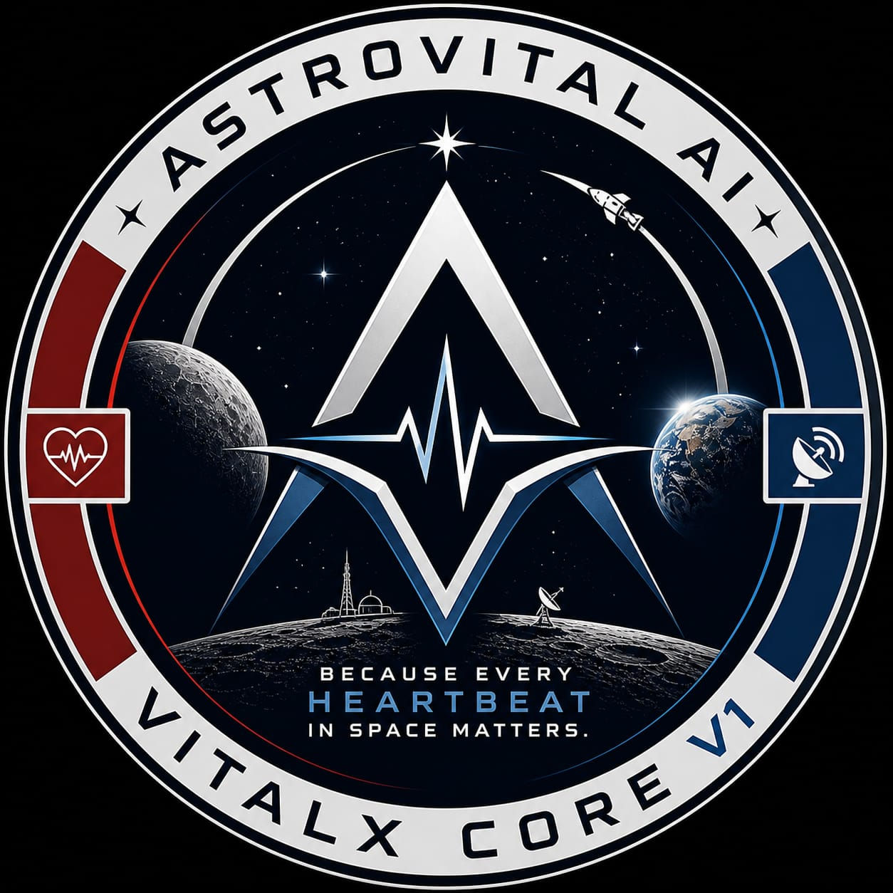

<div align="center">



# ASTROVITAL CC V1
### Jagannath Command Center · Edge-Deployed CDSS

[](.)
[](.)
[](.)
[](LICENSE)
[](.)

*"Because Every Heartbeat in Space Matters."*

**Developer:** Gouragopal Mohapatra  
**Powered by:** ***VITALX CORE V1***  
**Deployment:** Edge Only · Air-Gapped · No Cloud

</div>

---

## Overview

**ASTROVITAL CC V1** is a mission-critical,
edge-deployed Clinical Decision Support System
built on VITALX CORE V1 — the first working
astronaut health CDSS implementation.

100% offline. Zero cloud dependency.
Runs entirely on local hardware.
Mars-mission ready.

---

## Key Features

| Feature | Aerospace Term | Description |
|---|---|---|
| 🔐 **Secure Login** | Access Control | Local authentication — no cloud |
| 📡 **Live Vitals** | Bio-Telemetry Stream | Real-time physiological monitoring |
| 🧠 **AI Decision** | XAI — White-Box CDSS | VitalX Core V1 predictions |
| 💾 **Data Records** | OBDH | Local SQLite telemetry vault |
| ⚙️ **System Health** | BITE | CPU, RAM, model integrity check |
| 📖 **User Manual** | Mission Ops Guide | Complete operational guide |

---

## Tech Stack

| Component | Technology |
|---|---|
| Frontend | Streamlit |
| Language | Python 3.12 |
| Visualization | Plotly · Matplotlib |
| AI Engine | VITALX CORE V1 |
| Storage | SQLite · Local JSON |
| Deployment | Edge · LAN · Standalone |

---

## Project Structure
ASTROVITAL_CC_V1/
├── app.py
├── requirements.txt
├── .streamlit/
│   └── config.toml
├── assets/
│   ├── css/
│   └── icons/
├── interface/
│   ├── home.py
│   ├── vitals.py
│   ├── ai_decision.py
│   ├── data_records.py
│   ├── system_health.py
│   └── user_manual.py
├── core/
├── data/
│   └── logs/
└── simulations/

---

## Installation

### Step 1 — Install dependencies
```bash
pip install streamlit plotly pandas
       joblib scikit-learn psutil Pillow
```

### Step 2 — Run locally
```bash
streamlit run app.py
```

### Step 3 — Run on LAN
```bash
streamlit run app.py \
  --server.address 0.0.0.0 \
  --server.port 8501
```

Access from other devices:
http://[YOUR_IP]:8501

---

## Deployment Options

| Option | Use Case | Command |
|---|---|---|
| Local | Single user | `streamlit run app.py` |
| LAN | Team / Clinic | `--server.address 0.0.0.0` |
| EXE | Windows portable | `pyinstaller --onefile app.py` |

---

## Privacy & Security

- ✅ 100% Edge-Only — no data leaves device
- ✅ No Cloud — works completely offline
- ✅ Local Authentication — JSON based
- ✅ No External APIs — everything local
- ✅ Air-Gapped — zero internet dependency

---

## Troubleshooting

| Issue | Solution |
|---|---|
| Port in use | `--server.port 8502` |
| Logo not showing | Check `assets/icons/astro_logo.jpeg` |
| Model loading error | Verify MODEL_HANGAR path |
| LAN access denied | Allow port in Windows Firewall |

---

## Powered By

This platform is powered by **VitalX Core V1.0** —
the first working edge-deployed CDSS for astronaut
health monitoring, built on 12 peer-reviewed
spaceflight research papers.

→ [ASTROVITAL AI : VITALX CORE V1](https://github.com/GOURGOPAL618/ASTROVITAL_AI_VITALX_CORE_V1)

---

## Copyright
© 2026 Gouragopal Mohapatra — All Rights Reserved
AstroVital JCC V1.0 — Independent Research — India
Unauthorized use strictly prohibited under
Indian Copyright Act, 1957.

---

<div align="center">

**ASTROVITAL CC V1**
*Mission Ready · Edge Only · No Cloud*

*"Because Every Heartbeat in Space Matters."*

© 2026 Gouragopal Mohapatra · All Rights Reserved

</div>
